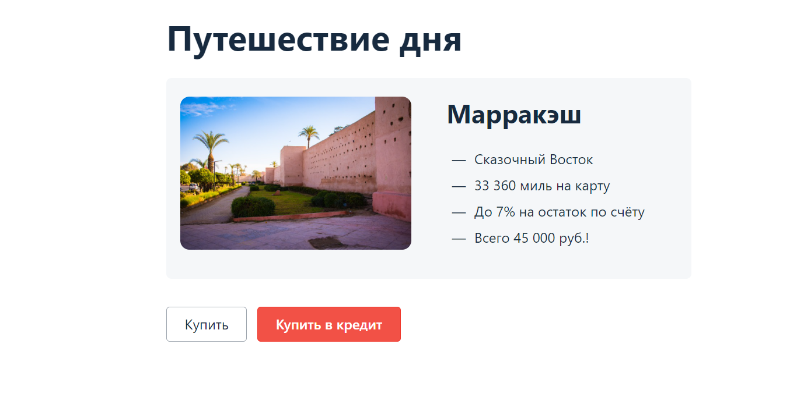

### Отчет об автоматизации

Для тестирования представлено приложение "Марракэш", которое предлагает купить тур двумя способами оплаты: по дебетовой карте и выдача кредита по данным банковской карты.

Запланировано протестировать покупку тура с помощью дебетовой карты:
- проверка всех верных введенных данных карты;
- проверка возможности купить тур с истекшим сроком действия карты (месяц, год);
- проверка возможности купить тур с введением невалидного имени
- проверка правильности сохранения данных в базе данных тура;

Запланировано протестировать покупку тура в кредит по данным карты:
- проверка всех верных введенных данных карты;
- проверка возможности купить тур с истекшим сроком действия карты (месяц, год);
- проверка возможности купить тур с введением невалидного имени
- проверка правильности сохранения данных в базе данных тура;

При тестировании покупки тура с помощью дебетовой карты составлено 7 тест-кейсов
При тестировании покупки тура в кредит по данным карты, составлено 7 тест-кейсов

Для тестирования приложения запланировано 160 часов
Тестирование выполнено с учетом рисков, потрачено 200 часов (Риски при тестировании возникли из-за неверно поставленных приоритетов и невозможности быстро найти необходимую информацию и документацию для составления авто-тестов)

Для проведения авто-тестов использовалось программное обеспечение:
1. OpenJDK - это программный пакет, который используется для создания Java-приложений (будем использовать OpenJDK11).
2. IntelliJ IDEA - интегрированная среда разработки программного обеспечения для многих языков программирования, в частности Java, JavaScript, Python
3. Docker - программное обеспечение для автоматизации развёртывания и управления приложениями в средах с поддержкой контейнеризации
4. DBeaver - бесплатный универсальный инструмент для работы с базами данных